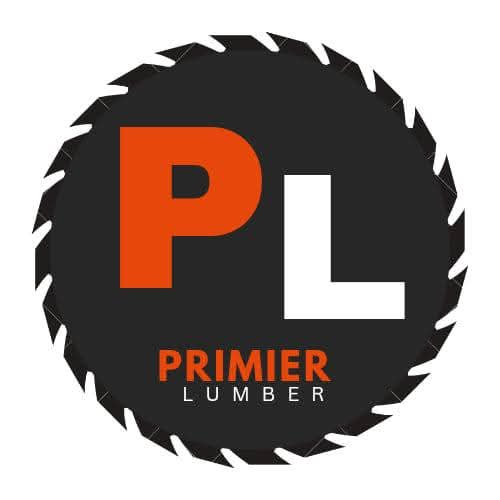

# Premier Lumber Company Website

A modern, responsive website for Premier Lumber Company - a family-owned lumber yard serving Northwest Indiana since 1994.



## 🌲 About

Premier Lumber Company provides quality wood products and services including:
- **Pallets** - Buy & sell new and used pallets
- **Firewood** - Seasoned hardwood sold by the cord
- **Sawdust & Shavings** - For animal bedding and landscaping
- **Free Log Pickup** - We haul away your logs at no cost
- **Lumber & Building Materials** - Custom cuts and standard sizes

## 🚀 Features

- ✅ **Fully Responsive** - Works on desktop, tablet, iOS, and Android
- ✅ **Fast Loading** - Optimized CSS and minimal JavaScript
- ✅ **SEO Optimized** - Meta tags, structured data, and semantic HTML
- ✅ **Accessible** - ARIA labels, keyboard navigation, skip links
- ✅ **Contact Forms** - Quick quote and full contact forms
- ✅ **Business Hours** - Live open/closed status indicator
- ✅ **FAQ Section** - Accordion-style frequently asked questions
- ✅ **Photo Gallery** - Showcase of lumber yard and projects

## 📁 File Structure

```
premier-lumber-site/
├── index.html          # Main homepage
├── privacy.html        # Privacy policy
├── terms.html          # Terms of service
├── style.css           # Main stylesheet (all CSS)
├── logo.jpg            # Company logo
├── favicon.ico         # Browser favicon
├── robots.txt          # Search engine directives
├── sitemap.xml         # XML sitemap for SEO
├── images/
│   └── gallery/        # Photo gallery images
│       ├── lumber_yard_hero.jpg
│       ├── delivery_truck.jpg
│       ├── framing_project.jpg
│       ├── pallets_stack.jpg
│       ├── firewood_seasoned.jpg
│       └── plywood_stock.jpg
└── README.md           # This file
```

## 🎨 Design System

### Colors
| Color | Hex | Usage |
|-------|-----|-------|
| Brand Orange | `#ea580c` | Primary buttons, CTAs, accents |
| Dark Orange | `#c2410c` | Hover states |
| Light Orange | `#fff7ed` | Backgrounds, icon containers |
| Charcoal | `#1f242b` | Headers, dark sections |
| Ink | `#0f1729` | Body text |
| Success Green | `#16a34a` | Badges, confirmations |

### Typography
- **Headings**: Space Grotesk (500, 600 weight)
- **Body**: Manrope (400, 500, 600, 700 weight)

## 🛠️ Tech Stack

- **HTML5** - Semantic markup
- **CSS3** - Custom properties, Grid, Flexbox
- **Vanilla JavaScript** - No frameworks required
- **Google Fonts** - Manrope, Space Grotesk
- **FormSubmit** - Contact form handling (no backend required)

## 📱 Browser Support

- Chrome (latest)
- Firefox (latest)
- Safari (latest, including iOS)
- Edge (latest)
- Samsung Internet

## 🚀 Deployment

### Hostinger (Recommended)
1. Log in to Hostinger control panel
2. Go to File Manager → public_html
3. Upload all files from this repository
4. Site will be live at your domain

### Other Hosting
Upload all files to your web server's public directory. No build step required - this is a static site.

### Local Development
```bash
# Using Python
python -m http.server 8080

# Using Node.js (npx)
npx serve

# Using PHP
php -S localhost:8080
```

## 📞 Contact Information

**Premier Lumber Company**
- 📍 6717 Atcheson Drive, Gary, IN 46403
- 📞 (219) 938-6275
- 🕐 Mon-Fri: 7:00 AM - 5:00 PM | Sat: 8:00 AM - 12:00 PM

## 📄 License

© 2026 Premier Lumber Company. All rights reserved.

## 🔧 Customization

### Updating Contact Info
Edit the following files:
- `index.html` - Multiple locations (header, footer, contact section)
- `privacy.html` - Footer section
- `terms.html` - Footer section

### Updating Hours
Search for "7:00 AM" in:
- `index.html` - Business hours card, footer, contact info
- Update the JavaScript `updateOpenStatus()` function for live status

### Adding Gallery Images
1. Add images to `/images/gallery/`
2. Update the gallery section in `index.html`
3. Recommended size: 800x600px, JPG format

---

**Built with ❤️ for Premier Lumber Company**
